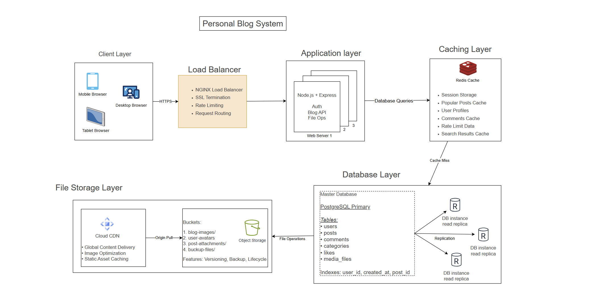

# Personal Blog System Design

## Overview
A multi-user blogging platform where users can create accounts, publish blog posts, and read others' content. Built with progressive scalability in mind.

## Functional Requirements
- **User Management**: Register, login, user profiles
- **Content Creation**: Write, edit, delete blog posts
- **Content Discovery**: Browse all posts, search posts, categories
- **Engagement**: Comment on posts, like posts
- **Media**: Upload images for posts

## Non-Functional Requirements
- **Users**: 10,000 registered users, 100,000 monthly readers
- **Performance**: Page load < 2 seconds
- **Availability**: 99.9% uptime
- **Data**: Store posts, users, comments, media files

## Version 1: Simple Architecture (Day 1)
```
[Web Browser] → [Web Server] → [Database]
↓
[File Storage]
```

### Components:
1. **Web Server**: Handles HTTP requests, renders blog pages
2. **Database**: Stores users, posts, comments (PostgreSQL/MySQL)
3. **File Storage**: Stores uploaded images

### Database Schema:
```
-- Users table
users (
id: PRIMARY KEY,
username: VARCHAR UNIQUE,
email: VARCHAR UNIQUE,
password_hash: VARCHAR,
created_at: TIMESTAMP
)

-- Posts table
posts (
id: PRIMARY KEY,
user_id: FOREIGN KEY → users(id),
title: VARCHAR,
content: TEXT,
created_at: TIMESTAMP,
updated_at: TIMESTAMP,
published: BOOLEAN
)

-- Comments table
comments (
id: PRIMARY KEY,
post_id: FOREIGN KEY → posts(id),
user_id: FOREIGN KEY → users(id),
content: TEXT,
created_at: TIMESTAMP
)
```


## Version 2: Scaled Architecture (Future)



```
[Users] → [Load Balancer] → [Web Server 1, Web Server 2]
↓
[Master DB] ← [Read Replicas]
↓
[Redis Cache] + [CDN for Images]
```


### Scaling Strategy:
1. **Add Load Balancer** when single server reaches CPU limit
2. **Add Read Replicas** when database queries slow down  
3. **Add Redis Cache** for frequently accessed posts
4. **Add CDN** for faster image loading globally

## API Design

### Core Endpoints:
```
GET /posts - List all published posts
GET /posts/:id - Get specific post with comments
POST /posts - Create new post (authenticated)
PUT /posts/:id - Update post (owner only)
DELETE /posts/:id - Delete post (owner only)

GET /users/:id - Get user profile
POST /auth/login - User login
POST /auth/register - User registration

POST /posts/:id/comments - Add comment to post
GET /posts/:id/comments - Get post comments
```


## Technology Stack (Beginner-Friendly)
- **Backend**: Node.js + Express.js or Python + Flask
- **Database**: PostgreSQL (relational, ACID compliant)
- **Frontend**: HTML, CSS, JavaScript (or React for SPA)
- **File Storage**: Local filesystem (upgrade to AWS S3 later)

## Performance Optimizations
1. **Database Indexing**: Index on user_id, created_at for fast queries
2. **Pagination**: Show 10 posts per page, not all posts at once  
3. **Image Optimization**: Compress uploaded images
4. **Basic Caching**: Cache popular posts in Redis

## Security Considerations
- **Authentication**: JWT tokens or session-based
- **Authorization**: Users can only edit their own posts
- **Input Validation**: Sanitize post content to prevent XSS
- **Rate Limiting**: Prevent spam posting

## Deployment Strategy (Simple)
1. **Development**: Run locally with database
2. **Production**: Deploy to single VPS (DigitalOcean/Linode)
3. **Database**: PostgreSQL on same server
4. **Files**: Store uploads in `/uploads` folder
5. **Process Manager**: Use PM2 (Node.js) or Gunicorn (Python)

## Monitoring & Logging
- **Application Logs**: Log user actions, errors
- **Database Performance**: Monitor slow queries
- **Basic Metrics**: Response times, error rates
- **Health Check**: `/health` endpoint returning server status

## Future Enhancements (Week 2+)
- **Caching Layer**: Redis for popular posts
- **Search**: Elasticsearch for full-text search
- **Real-time**: WebSocket for live comments  
- **Analytics**: Track popular posts, user engagement
- **Mobile App**: REST API can serve mobile clients

## Quick Start Commands

Setup database
createdb blogdb

Install dependencies
npm install express pg bcrypt jsonwebtoken

Run development server
npm start

Create first user and post
```
curl -X POST localhost:3000/auth/register
-d '{"username":"admin","email":"admin@blog.com","password":"password123"}'
```
